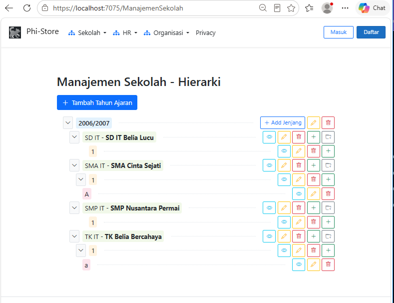
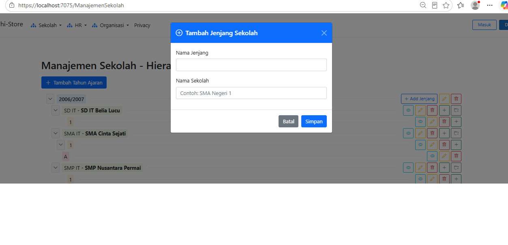
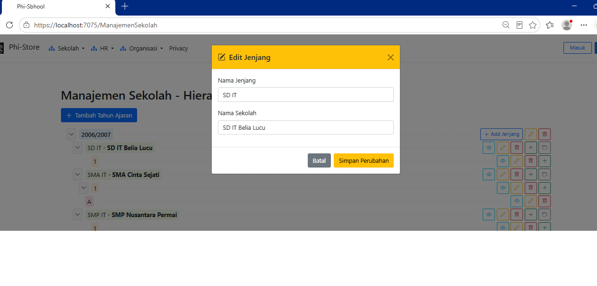

## 🌳 Tree View Implementation (ASP.NET MVC)

In this project, a **Tree View** component is utilized in ASP.NET MVC to effectively display and manage hierarchical data structures—such as parent-child relationships in a Chart of Accounts (General Ledger).

### ⚙️ How It Works
1. **Domain:**
   * Contains classes representing database tables.
   * Passed to the repository to form relations with the database.

2. **Repository:**
   * Contains classes for all database operations. All database interactions go through these classes.
   * Provides interfaces for access from the Services layer.

3. **Services:**
   * Acts as a bridge between repositories and the UI.
   * Provides interfaces for access from the views.

4. **Controller & Services Layer:**
   * The backend fetches flat relational data from the database and processes it into a hierarchical nested model (parent nodes containing lists of child nodes).
   * Passed to the view via strongly-typed ViewModels.
5. **DTO**
   * Representation  the need of User Interface to Data format, Services will convert it to Domain (class) and then to Repository .
     

6. **View Presentation:**
   * Utilizes HTML/CSS along with JavaScript/jQuery plugins (or recursive partial views) to dynamically render expandable and collapsible tree nodes.
   * Allows users to intuitively navigate multi-level categories, view account codes, and manage parent-child balances directly from the web interface.

### 🚀 Key Benefits
* **Structured Navigation:** Simplifies complex hierarchical data into a clean, collapsible interface.
* **Improved UX:** Enhances user experience when dealing with nested financial structures or categorical data.
image:
  

